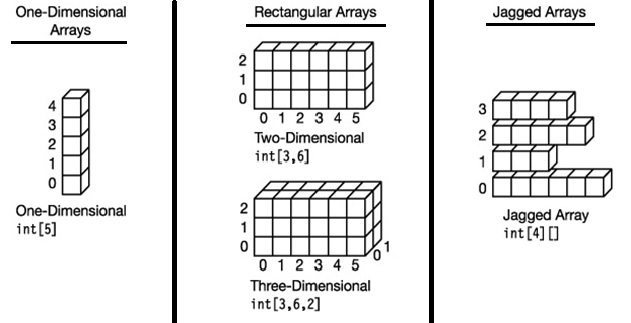

# Arrays

## Quick Review of Arrays

- **Array** - Represents a fixed number of variables of a particular type

## Types of Arrays in C#

### Two types of Arrays


#### Single Dimensional Array

```csharp
var numbers = new int[5];

var numbers = new int[5]{ 1, 2, 3, 4, 5 };
```

#### Multidimensional Array



- jagged array
  - you can think of this array as an "array of arrays"

#### syntax for declaring a 2D rectangular array

```csharp
var matrix = new int[3, 5]
// if you know the values ahead of time
{
    {1, 2, 3, 4, 5},
    {6, 7, 8, 9, 10},
    {11, 12, 13, 14, 15}
};

// to acess an element
var element = matrix[0, 0];

//declare a 3D array
var colors = new int[3, 5, 4];
```

#### syntax for declaring a jagged array

```csharp
// 1. declare a top level array
var array = new int [3][];

// 2. initialize each element in the array to a different array
array[0] = new int[4];
array[1] = new int[5];
array[2] = new int[3];
```

## Array Methods
