# Section 2: Classes

## Introduction to Classes

### What is a class

A building block of software applications

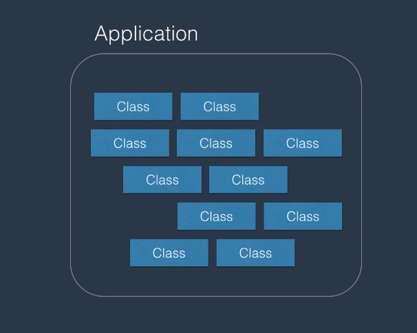

### Real-world example of classes

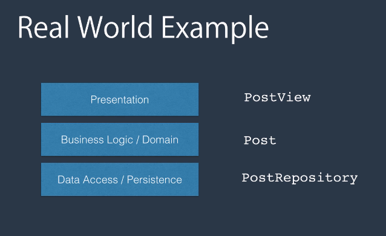

### Anatomy of a class

- Data (represented by fields)
- Behavior (represented by methods/functions)

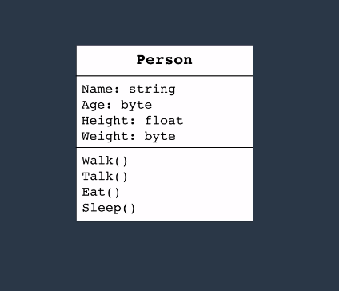
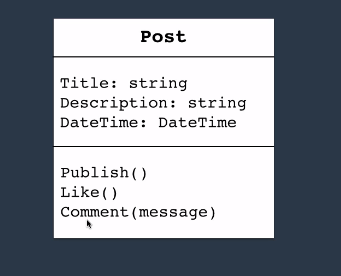

### What is an object

- An instance of a class.

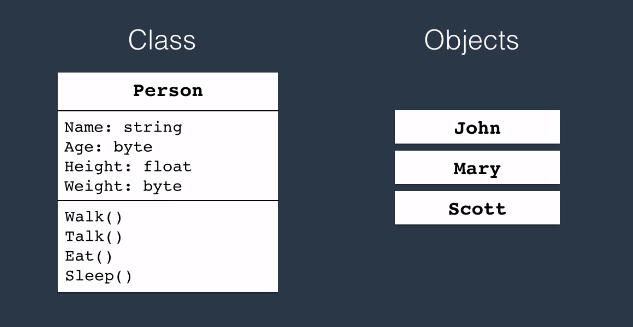

### Declaring a class in C#

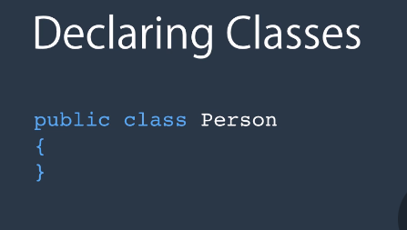
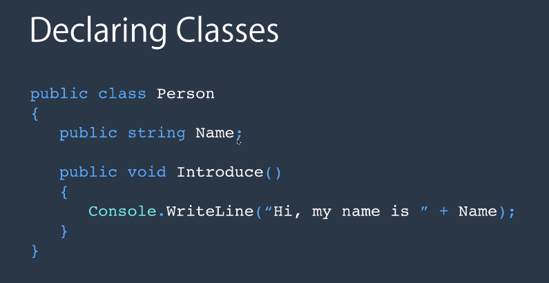
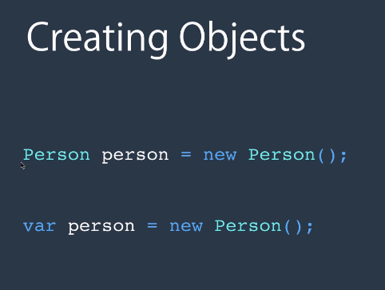
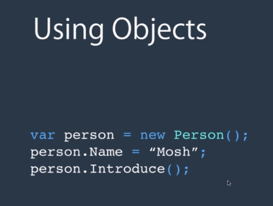

### Class Members

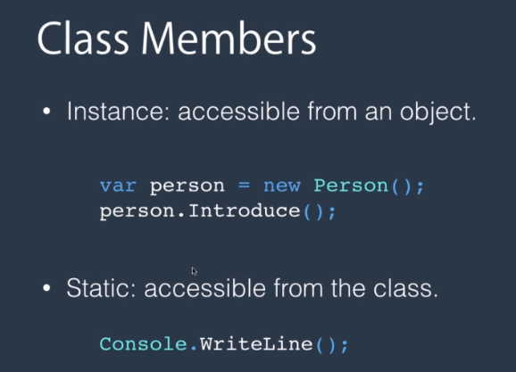
2 types

### Why Use Static Members?

- To represent concepts that are singleton.
- DateTime.Now
- Console.WriteLine()

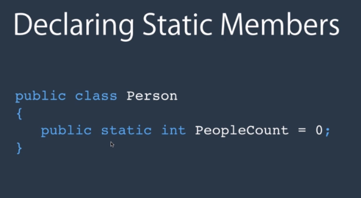

## Constructors

**What is a constructor -**
A method that is called when an instance of a class is created.

**Why do we need a constructor -**
To put an object in an early state.

**Ho wto declare a constructor**
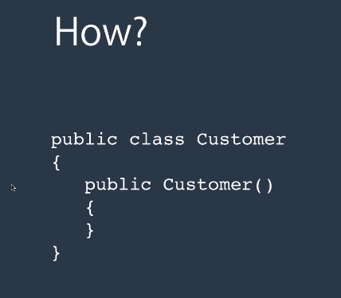

- this is a default or parameterless constructor

**Constructor Example 2**
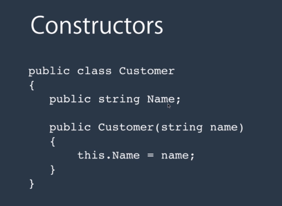'

**Constructor Overloading**

- **Overloading** - Having a method of the same name but different signatures

---

## Object Initializers

- An object initializer is a syntax for quickly initializing an object without the need to call one of its constructors.

- Why do you need one? To avoid creating multiple constructors

This is how they used to do things
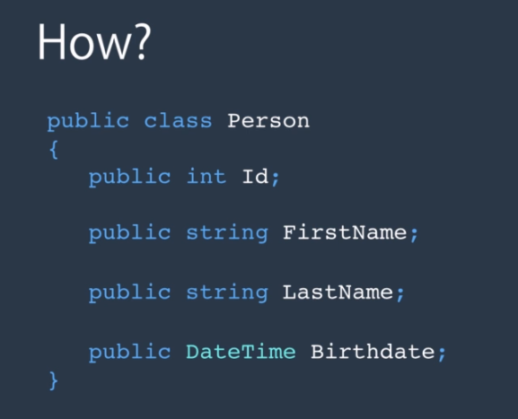

This is an object initializer
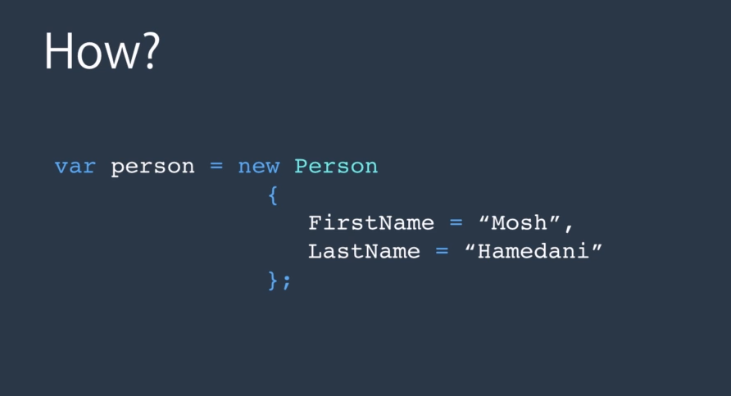

---

## Methods

### Agenda

- Signature of methods
- Method Overloading
- Params modifier
- Ref modifier
- Out modifier

### Signature of a Method

- Consists of:
  - Name
  - Number nd Type of parameters

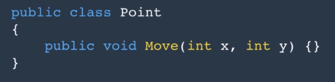

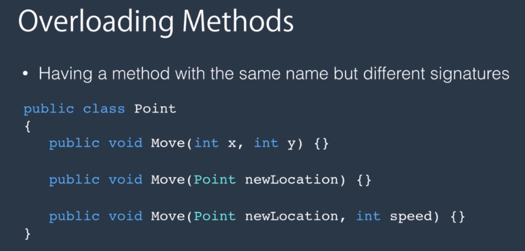

### Method Overloading

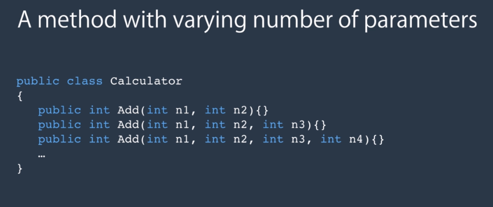
_this is not efficient_

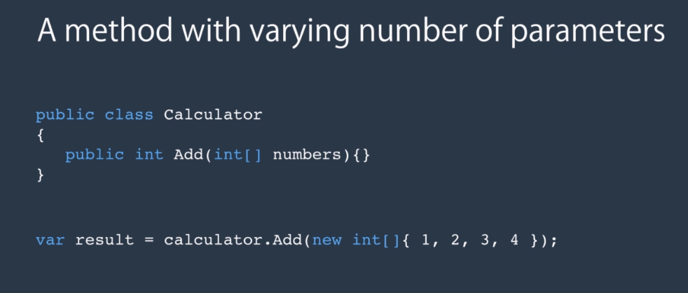
_this is much more efficient_

_the problem is that when we want to pass a number of arguments to this add method, we have to create and initialize and array_

### Params Modifier

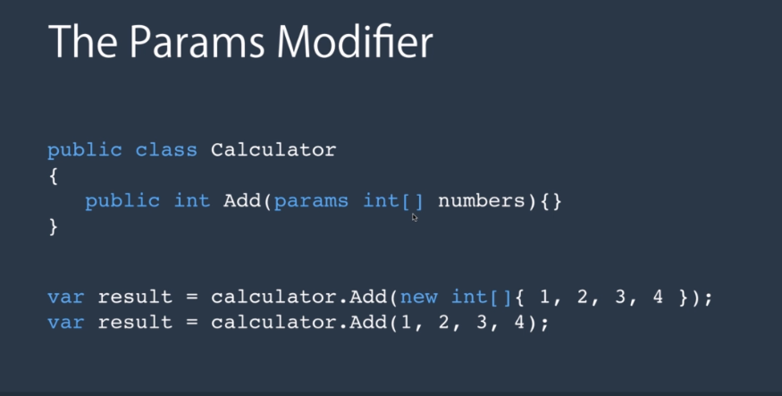

### Ref Modifier

This is inefficient and no one really uses it
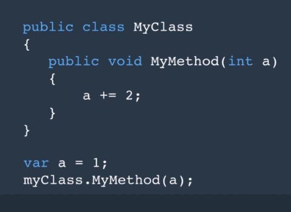
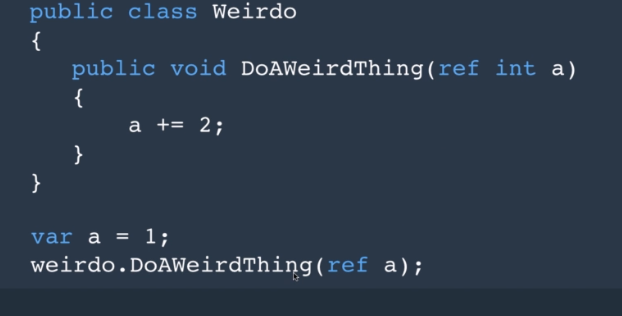

## Out Modifier

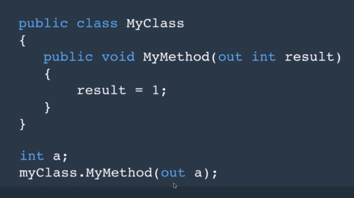
