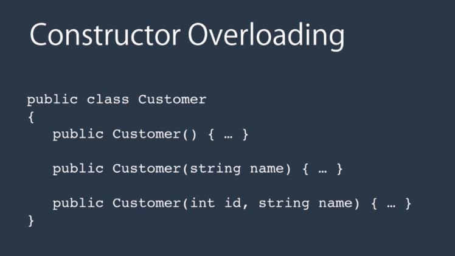

# Section 2: Classes

## Introduction to Classes

### What is a class

A building block of software applications

### Real-world example of classes

### Anatomy of a class

- Data (represented by fields)
- Behavior (represented by methods/functions)

### What is an object

- An instance of a class.

### Declaring a class in C#

### Class Members

2 types

### Why Use Static Members?

- To represent concepts that are singleton.
- DateTime.Now
- Console.WriteLine()

## Constructors

**What is a constructor -**
A method that is called when an instance of a class is created.

**Why do we need a constructor -**
To put an object in an early state.

**Ho wto declare a constructor**

- this is a default or parameterless constructor

**Constructor Example 2**
'

**Constructor Overloading**

